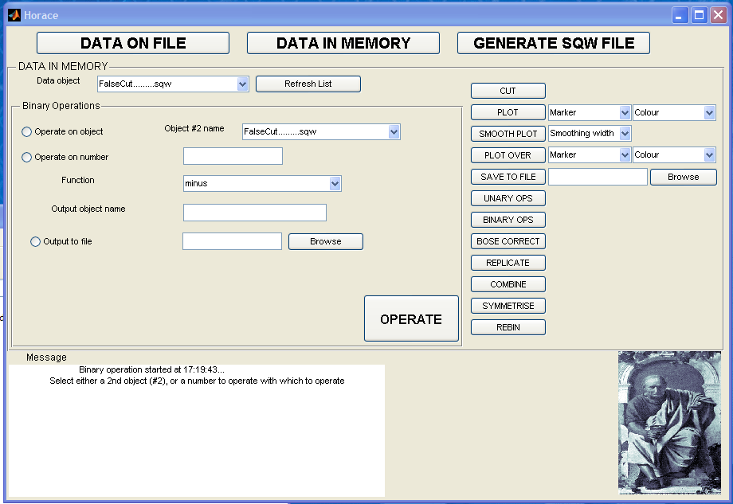
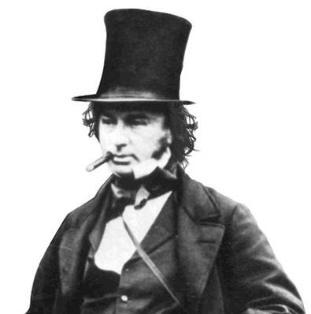

################
Test_page_wibble
################

 Original image

Changed code for original image

\ `bin ops <image:Binary_ops.png>`__

Convert format of an image to jpg, from png

As above, but without resizing

\ `bin ops <image:Binary_ops.jpg>`__

New image

New image, new code

\ `Brunel <image:14brunel1.jpg>`__ Binary_ops.
